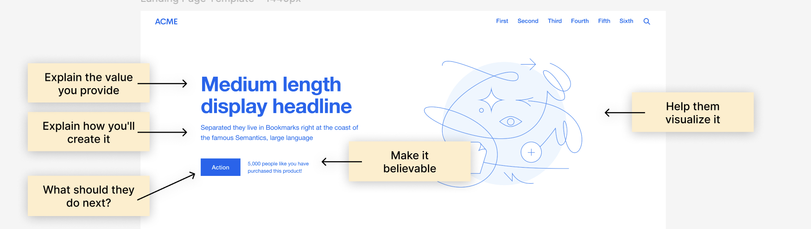

# Landing Page Template

This project is a Next.js implementation of a landing page template based on the Figma design by [Flux with Ran Segall](https://www.youtube.com/flux-with-ran-segall). The original design can be found [here](<https://www.figma.com/design/o5yDdlE9zbD4pFLg7VTiax/Landing-Page-Structure-Template-(Community)?node-id=0-1&node-type=canvas&t=tdVqDzx3Mnogz8BF-0>).

## About the Project

This landing page template offers a rapid solution for building high-converting landing pages, incorporating best practices in marketing and design. Key features include:

- Optimized element positioning for maximum impact
- Strategic copy placement to instantly resonate with your target audience
- Pre-structured sections following proven marketing principles

The template's layout is designed to:

- Capture attention with a clear, concise headline
- Elaborate on value delivery through a persuasive subheadline
- Drive action with a prominent, compelling CTA
- Build trust using social proof and credibility indicators
- Engage visually with strategically placed imagery

By leveraging this template, you can quickly create a landing page that effectively communicates your product's value proposition and encourages visitor conversion, saving time while adhering to marketing best practices.

The template follows best practices for landing page design, ensuring proper positioning and structure of key elements:

- A clear, medium-length display headline that explains the value proposition
- A subheadline that elaborates on how the value will be delivered
- A prominent call-to-action button with persuasive text
- An eye-catching visual element to help users visualize the offer
- Social proof or credibility indicators to make the offer more believable

This structure helps guide visitors through the page, clearly communicating the product or service's value and encouraging them to take action. The layout is designed to be easily customizable while maintaining these core principles of effective landing page design.



## Technologies Used

This is a [Next.js](https://nextjs.org) project bootstrapped with [`create-next-app`](https://nextjs.org/docs/app/api-reference/cli/create-next-app).

## Getting Started

First, run the development server:

```bash
npm run dev
# or
yarn dev
# or
pnpm dev
# or
bun dev
```

Open [http://localhost:3000](http://localhost:3000) with your browser to see the result.

You can start editing the page by modifying `app/page.tsx`. The page auto-updates as you edit the file.

This project uses [`next/font`](https://nextjs.org/docs/app/building-your-application/optimizing/fonts) to automatically optimize and load [Geist](https://vercel.com/font), a new font family for Vercel.

## Customization

Feel free to modify the components and styles to fit your specific needs. The structure follows the original Figma design, but you can easily adapt it to your requirements.

## Learn More

To learn more about Next.js, take a look at the following resources:

- [Next.js Documentation](https://nextjs.org/docs) - learn about Next.js features and API.
- [Learn Next.js](https://nextjs.org/learn) - an interactive Next.js tutorial.

You can check out [the Next.js GitHub repository](https://github.com/vercel/next.js) - your feedback and contributions are welcome!

## Deploy on Vercel

The easiest way to deploy your Next.js app is to use the [Vercel Platform](https://vercel.com/new?utm_medium=default-template&filter=next.js&utm_source=create-next-app&utm_campaign=create-next-app-readme) from the creators of Next.js.

Check out our [Next.js deployment documentation](https://nextjs.org/docs/app/building-your-application/deploying) for more details.

## Credits

Design: [Flux with Ran Segall](https://www.youtube.com/flux-with-ran-segall)
Implementation: [@lucadi_domenico](https://x.com/lucadi_domenico)

## License

This project is licensed under the MIT License:

MIT License

Copyright (c) [2024] [Luca Di Domenico]

Permission is hereby granted, free of charge, to any person obtaining a copy
of this software and associated documentation files (the "Software"), to deal
in the Software without restriction, including without limitation the rights
to use, copy, modify, merge, publish, distribute, sublicense, and/or sell
copies of the Software, and to permit persons to whom the Software is
furnished to do so, subject to the following conditions:

The above copyright notice and this permission notice shall be included in all
copies or substantial portions of the Software.

THE SOFTWARE IS PROVIDED "AS IS", WITHOUT WARRANTY OF ANY KIND, EXPRESS OR
IMPLIED, INCLUDING BUT NOT LIMITED TO THE WARRANTIES OF MERCHANTABILITY,
FITNESS FOR A PARTICULAR PURPOSE AND NONINFRINGEMENT. IN NO EVENT SHALL THE
AUTHORS OR COPYRIGHT HOLDERS BE LIABLE FOR ANY CLAIM, DAMAGES OR OTHER
LIABILITY, WHETHER IN AN ACTION OF CONTRACT, TORT OR OTHERWISE, ARISING FROM,
OUT OF OR IN CONNECTION WITH THE SOFTWARE OR THE USE OR OTHER DEALINGS IN THE
SOFTWARE.
